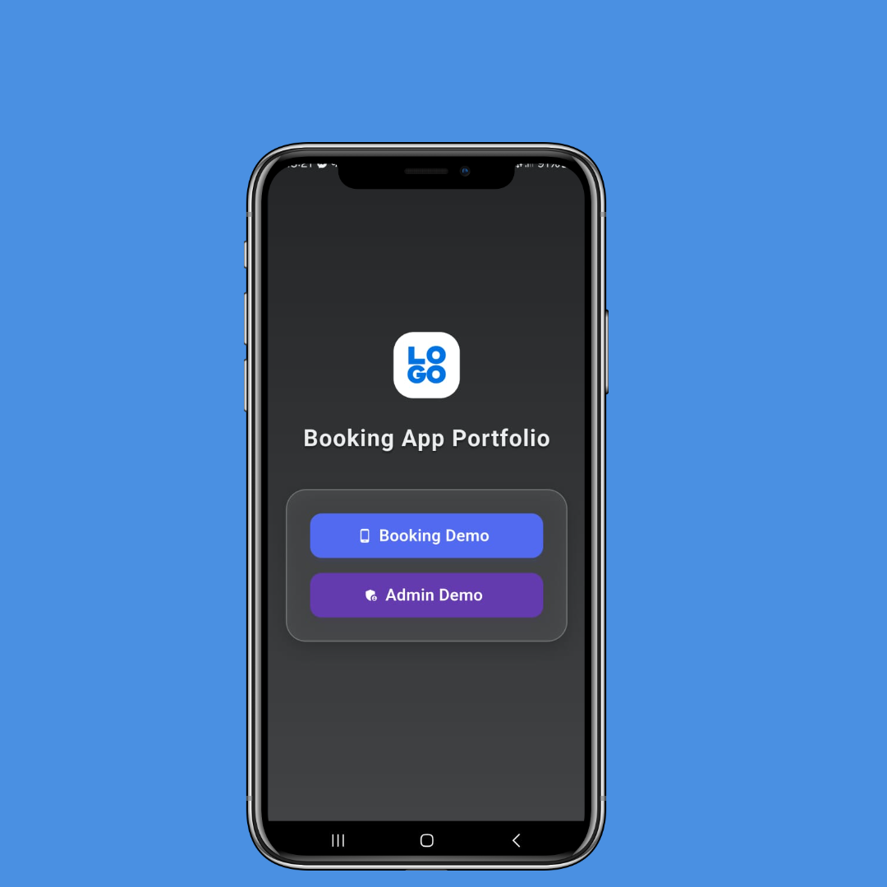
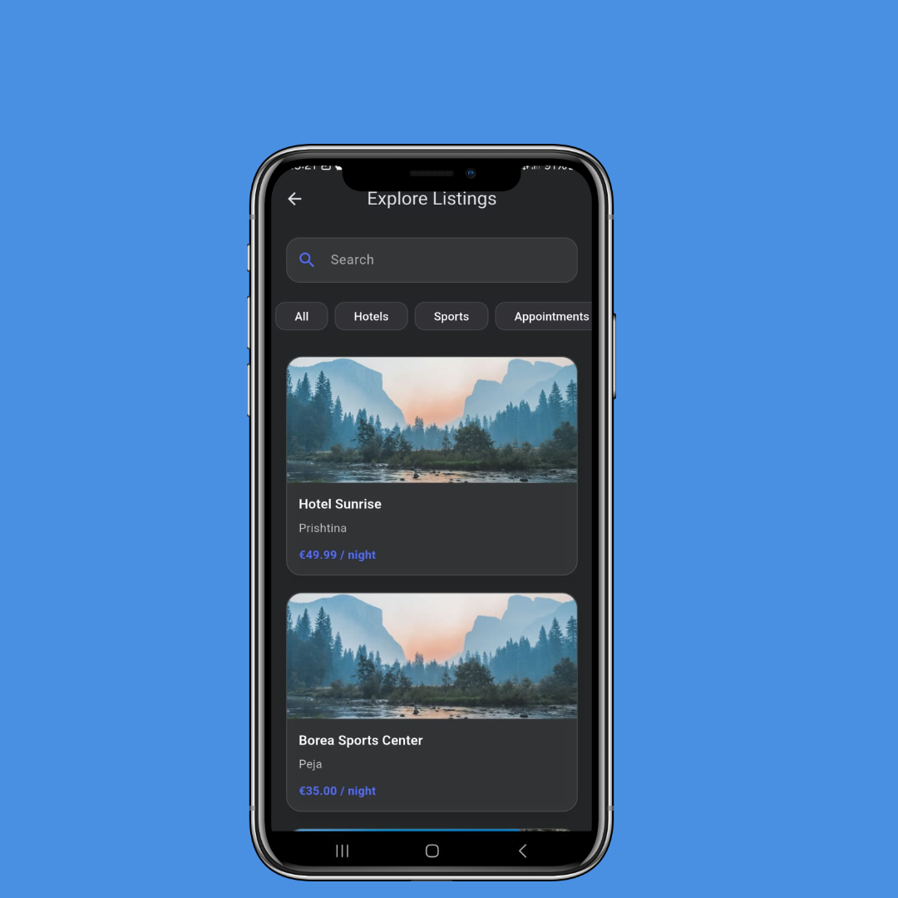
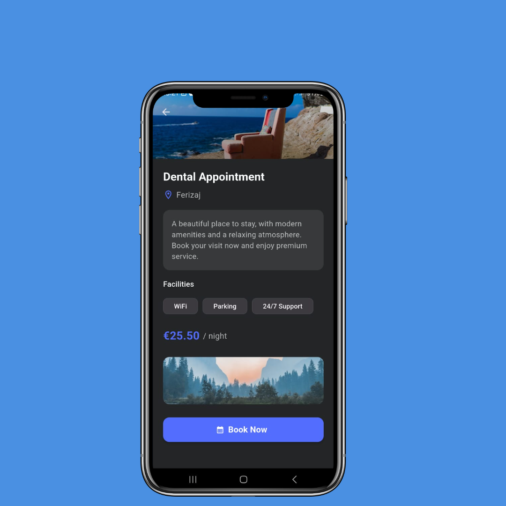
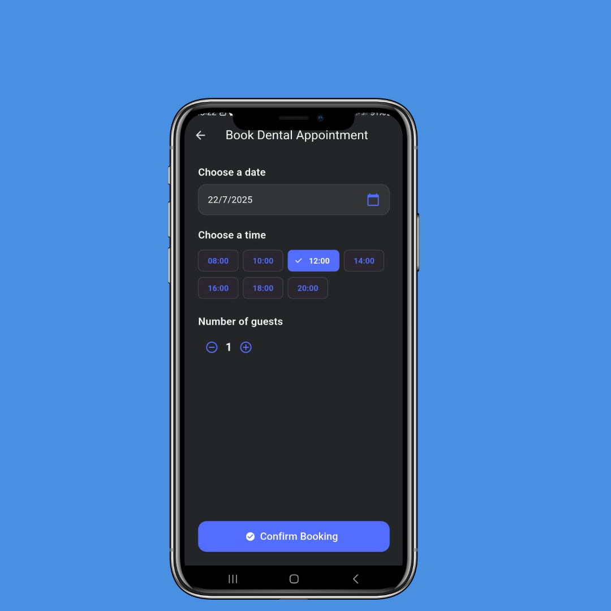
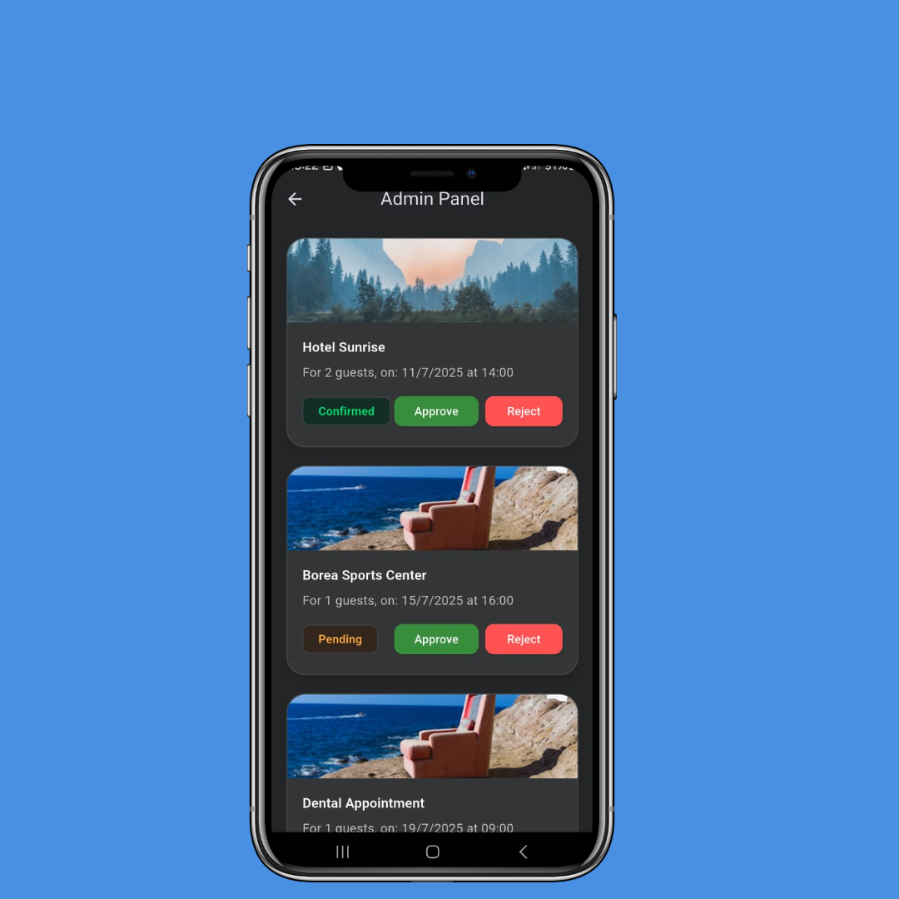

# Booking App UI Portfolio (Flutter)

A next-gen booking experience, built 100% in Flutter – designed to impress clients, recruiters, and collaborators on Upwork, GitHub, or anywhere you showcase your skills.

---

## ✨ Features

- **Material 3 design:** modern, calm colors & smooth animations
- **5+ polished UI screens:** Welcome, Home, Details, Booking, My Bookings, Admin
- **Demo data only:** All screens use hard-coded sample data for portfolio/demo
- **Pixel-perfect & responsive:** Looks great on mobile and tablet
- **Ready for customization:** Easy to adapt for any business case

---

## 📱 Screenshots

> *All screenshots were taken on real device emulators and framed with [shots.so](https://shots.so/) for a professional look!*

---

## ⚙️ Technology Stack

- **Flutter 3.x+** (null safety)
- **Dart**
- **Material 3**, custom widgets, smooth transitions

---

## 💡 Project Purpose

This app was built as a UI/UX portfolio project – every detail is carefully designed, every screen is fully responsive and production-ready.  
No backend, no real booking logic – just beautiful user experience.

---

## 🚀 Why Use This Template?

- Shows real-world, business-grade UI
- Instantly builds trust with clients: clean code, modern visuals, intuitive navigation
- Easily adaptable: swap in your data, your brand, your business
- Demo-ready: just add your backend or API integration!

---

## 🔄 Customization

- **Easy localization:** UI can be translated to any language on request
- **Branding:** Colors, logos, and images can be quickly customized for your client or project
- **Feature requests:** Want a real backend? Just ask!

---

## 📝 FAQ

**Is this a functional app?**  
> This version is a UI prototype for demonstration purposes – backend integration is available on request.

**Can you customize the design/branding?**  
> Absolutely! The design is modular and can be tailored to any use-case.

**Can you deliver a full app?**  
> Yes – with real backend and any custom features you need.

---

## 📂 File Structure (Clean Architecture)

